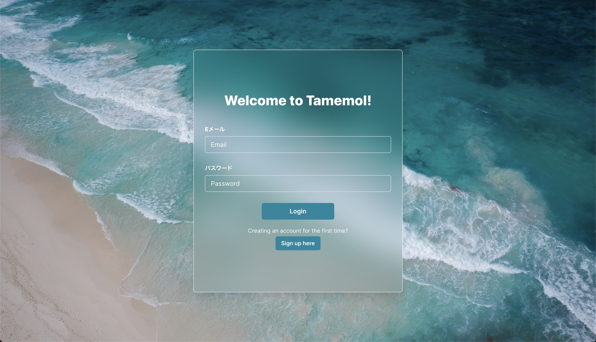
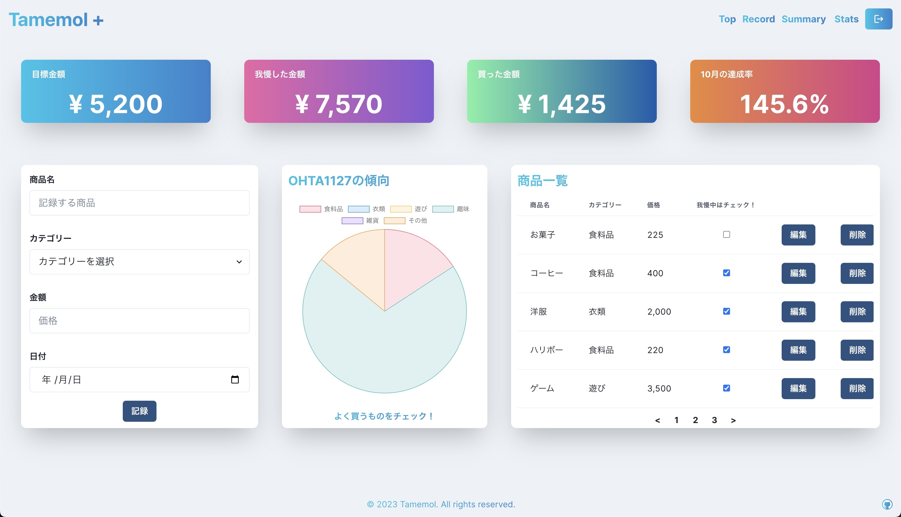
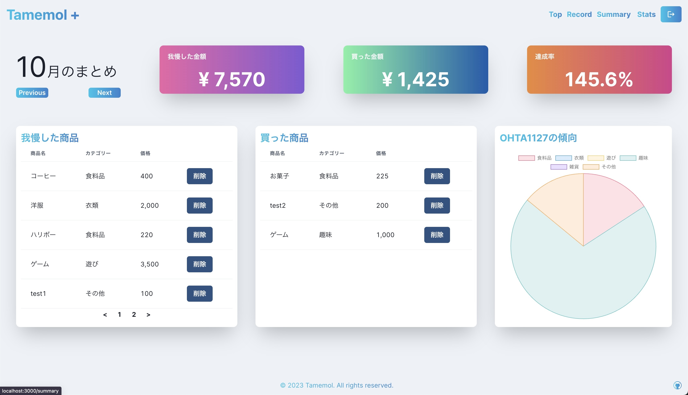
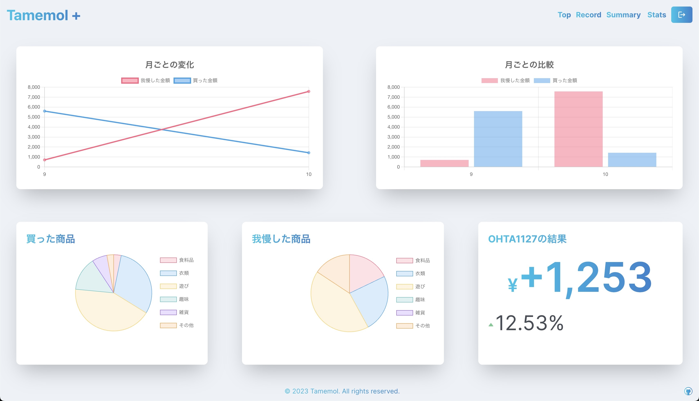

# Tamemol Plus

## サービス URL

https://github.com/OHTA1127 (デプロイ後更新)

## 概要

「Tamemol Plus」はあなたのの毎日のちょっとした無駄遣いをなくすことを目的とした家計簿アプリケーションです！ 
お菓子や買い物などで何かを我慢した時にメモ感覚で我慢したものを記録していくことで自分の頑張りを可視化させます。 
また買ってしまった物も記録していくことで何に自分がよく無駄遣いしてしまうかを分析することも可能となっています。

## アプリケーションを作ったキッカケ

「毎日のちょっとした無駄遣いを減らしたい！」と考えたのが最初のキッカケでした。 
「なんで無駄遣いをしてしまうのか」ということを考えた時に、小さい金額のものであればあるほど無意識的につい買ってしまうのではないかと考えました。 
そこで我慢したものをしっかりと記録に残すことで自分の頑張りを可視化し、より我慢することに対してのモチベーションを高めることで我慢につながるのではないかと思い、このアプリケーションを作りました！
また「Tamemol Plus」では自分が何によく無駄遣いをしてしまうのかということも分析することが可能なため、自分のことを理解しつつ無駄遣いを減らせます！

## 使用技術
#### フロントエンド言語

#### フロントエンドフレームワーク

#### バックエンド

#### CSSフレームワーク

#### その他

## 機能一覧

| topページ | authページ |
| :---: | :---: |
|  |  |
| アプリケーションのトップページです。 | メールアドレスとパスワードによる認証が行うことが可能。 サインアップとログインを切り替えることができ、まだアカウントを持っていない場合は新しいアカウントを作成してもらいます。 |

| recordページ | summaryページ |
| :---: | :---: |
|  |  |
| CRUD機能で我慢した商品の追加や削除、編集を行うページ。 このページではデフォルトで今月のデータが表示されます。 目標金額のカードをクリックすることで編集ページに遷移することができます。| 月ごとのデータを切り替えて表示するページ。 過去の我慢や購買情報を遡って確認できます。 |

| editページ | statsページ |
| :---: | :---: |
|  |  |
| ユーザー名と月にどれくらい我慢したいかを設定できます。 | 過去のすべてのデータをもとに今までの結果が表示されます。 グラフを用いることで一目で自分の我慢や何に多くお金を 使っているのかを確認することができます。|

## 苦労・工夫した点
### UI/UX
「Tamemol Plus」では特にUI.UXのに注力して作りました！自分は過去に「Tamemol Puls」の前身となる「Tamemol」というアプリケーションを作ったのですが、使用技術がHTML・CSS・Rubyのみであったため、実装したかったUIやUXを全て実装することができませんでした。 
しかし今年の夏に行かせていただいた中期のインターン先でフロントエンドの技術であるType ScriptやReact、Next.jsを学ぶことができ、「自分が本当に作りたかったものを作りたい！」という思いからもう一度作ることに決めました。 
どうすればユーザーが自分のことを直感的に理解でき、日々の我慢に繋げることができるかということを特に意識し、開発を進めました！

### Supabaseとの連携
Supabaseとの連携が特に苦労した点です。Next.jsでSupabaseを使用する場合、サーバーコンポーネントでデータの取得、クライアントコンポーネントでデータの作成・編集・削除を行う必要がありました。
そこで取得したデータをクライアントコンポーネントで使用しようとした場合、サーバーコンポーネントからpropsとして渡す必要があるなどディレクトリ構成を工夫必要がありました。

